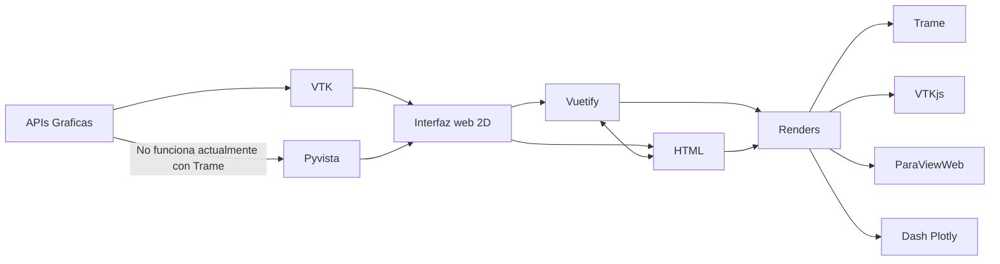

# State of the Art

Para realizar la aplicacion necesitaremos 3 componentes:

- Las *apis graficas* para renderizar los objetos vtk
- Las *Librerias graficas* para visualizar la web
- Los *renders* para montar la aplicación


## VTK

The Visualization Toolkit (VTK) is open source software for manipulating and displaying scientific data.VTK is part of Kitware’s collection of supported platforms for software development. 

### To show a mesh you will need: 

1. Create a Renderer:
    ```python
    import vtk

    renderer = vtk.vtkRenderer()
    ```
2. Create a window for the Renderer:
    ```python
    renderWindow = vtk.vtkRenderWindow()
    ```
3. Assign the render to the window:
    ```python
    renderWindow.AddRenderer(renderer)
    ```
4. Create a interactor for the window (optional):
    ```python
    renderWindowInteractor = vtk.vtkRenderWindowInteractor()
    renderWindowInteractor.SetRenderWindow(renderWindow)
    renderWindowInteractor.GetInteractorStyle().SetCurrentStyleToTrackballCamera()
    ```
5. Create or load a Source:
    - Create
        ```python
        cone_source = vtk.vtkConeSource()
        ```
    - Load:
        ```python
        reader = vtk.vtkUnstructuredGridReader()  # Use vtkUnstructuredGridReader for UNSTRUCTURED_GRID
        reader.SetFileName("Resources/info/ventricle_Tagged.vtk")
        reader.Update()
        unstructuredGridPort = reader.GetOutputPort()
        ```
6. Assign the source to a mapper:
    ```python
    mapper = vtk.vtkPolyDataMapper()
    mapper.SetInputConnection(cone_source.GetOutputPort())
    ```
7. Assing the mapper to a VTKActor:
    ```python
    actor = vtk.vtkActor()
    actor.SetMapper(mapper)
    ```
8. Add the VTKActor to the renderer
    ```python
    renderer.AddActor(actor)
    ```
9. Show de windows:
    ```python
    renderWindow.Render()
    ```

## PyVista

PyVista is a high-level API to the Visualization Toolkit (VTK) that made 3D plotting  simple and built for large/complex data geometries

### To show a mesh you will need: 

1. Make a Plotter
    ```python
    import pyvista as pv
    pl = pv.Plotter()
    ```
2. Load/Create a mesh
    - Create
        ```python
        mesh = pv.Wavelet()
        ```
    - Load
        ```python
        mesh = pv.read(path.name)
        ```
3. Add the mesh to the Plot
    ```python
    actor = pl.add_mesh(mesh)
    ```
4. Render the Plot
    ```python
    pl.show()    
    ```
## Conclusions 

As you can see its extremely easier to plot a mesh using pyvista than using VTK, however because we will need to render the plot on a page and not on our local computers VTK its gonna be more useful because not all renders have a pyvista module.