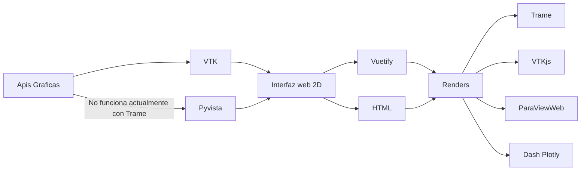

# State of the Art

Para realizar la aplicacion necesitaremos 3 componentes:

- Las *apis graficas* para renderizar los objetos vtk
- Las *Librerias graficas* para visualizar la web
- Los *renders* para montar la aplicación

